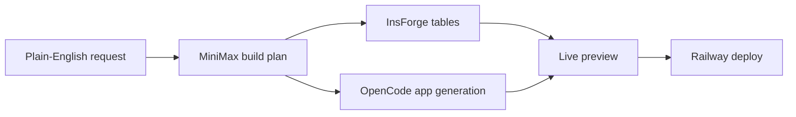
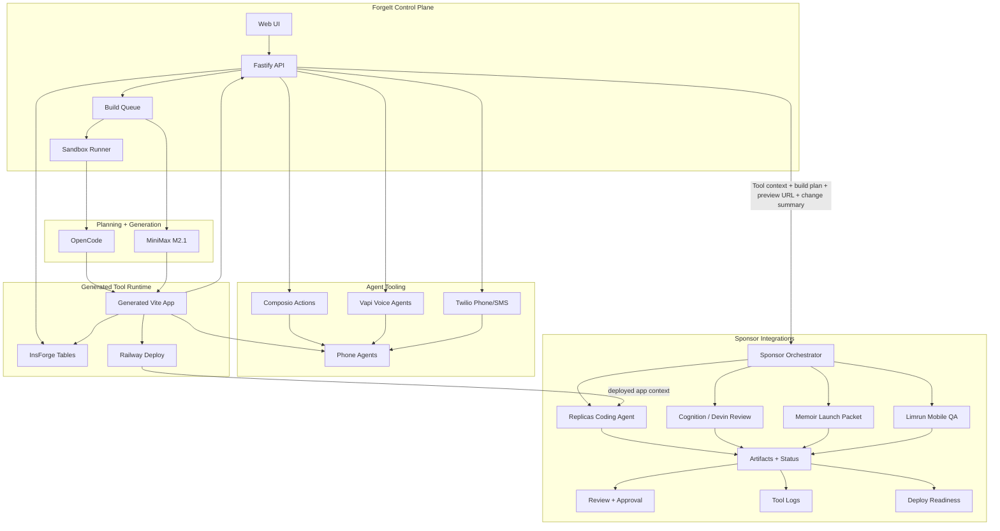

# ForgeIt

  

  <strong>Lovable for internal tools.</strong>

  ForgeIt turns a plain-English workflow into a planned, generated, previewable internal tool with real backend tables and integration-aware automations.

  <a href="https://forgeit.live/"><strong>Live website</strong></a>

  
  
  
  
  
  
  
  

## First User

<table>
  <tr>
    <td align="center" width="100%">
      
       
      <strong>Pleasure Pizza</strong>
       
      Early customer validation for ForgeIt's first operations workflow: a refund request dashboard for a real pizza shop team.
    </td>
  </tr>
</table>

## Product

ForgeIt starts where internal-tool requests usually start: a messy business workflow. It discovers the shape of the tool, drafts the plan, generates the app, provisions the backend, streams build progress, and gives the team a preview before anything goes live.

## First Workflow

| Step | Pizza shop refund workflow | ForgeIt output |
| --- | --- | --- |
| Request | "Build a refund dashboard for my pizza shop." | Normalized app intent and selected workflow type |
| Connect | Gmail, Stripe, Slack | Integration-aware build plan |
| Model | Refund requests, customers, payments, approvals | InsForge-backed tables |
| Build | Dashboard, queue, detail view, manager actions | Generated Vite app |
| Review | High-risk refund and notification actions | Approval-safe review and audit trail |

## Architecture

| Layer | Stack | Role |
| --- | --- | --- |
| Control plane | Vite, React, Tailwind | Gallery, forge flow, build logs, preview, deployment review |
| API server | Fastify, Prisma, SQLite | Tool state, queues, SSE streams, action routing |
| Planning | MiniMax M2.1 | Structured build plans and change summaries |
| Generation | OpenCode, sandbox runner | Creates and builds generated internal tools |
| App backend | InsForge | Per-tool data tables for generated apps |
| Integrations | Composio | Gmail, Slack, Stripe, and other workflow actions routed through generated tools |
| Agent tools | Vapi, Twilio, Composio | Voice agents, phone calls, SMS, and tool actions for operator workflows |
| Sponsor hooks | Replicas, Vapi, Cognition / Devin, Memoir, Limrun | Replicas powers the coding agent for Railway-deployed tools; voice, review, launch, and QA workflows extend the generated-tool lifecycle |
| Deployment | Railway | Public deployment target for approved tools |

## What It Proves

| Product question | ForgeIt answer |
| --- | --- |
| Can a non-technical operator describe an internal tool? | Yes, the input is a workflow prompt, not a ticket spec. |
| Can the system produce a real build plan? | Yes, pages, data models, integrations, workflows, and risks are structured before generation. |
| Can generated apps use a real backend? | Yes, generated tools are backed by InsForge tables. |
| Can high-risk actions stay approval-safe? | Yes, refunds, emails, and notifications are routed through reviewable action flows. |
| Can sponsor integrations extend the generated-tool lifecycle? | Yes, ForgeIt routes build plans, previews, changes, and approval context through sponsor-backed review, launch, and QA workflows. |

## Sponsor Integrations

ForgeIt is built around the hackathon sponsor stack: a user connects their company stack, describes the internal tool they need, ForgeIt creates the app, shows the plan, builds the backend, connects actions, and gives a clean review/approval flow. These integrations help each generated tool show what is connected, what was built, and what is safe to approve before anything goes live.

ForgeIt can also use connected agent tools like Twilio and Vapi to spin up phone-heavy operator workflows, including voice agents that handle calls, collect context, and hand results back into the generated tool.

| Sponsor | Integrated in ForgeIt as | What we're using it for |
| --- | --- | --- |
| InsForge | Backend for generated tools | ForgeIt uses InsForge to create secure backend tables for generated tools, including records like `RefundRequests`, `Customers`, and `AuditLogs`. Generated apps can read and write against those tables during preview and deployment. |
| Replicas | Railway coding agent | Replicas powers the coding agent that reviews, updates, and follows up on generated tools after they are built and deployed on Railway. |
| Vapi | Voice and phone-agent runtime | ForgeIt uses Vapi to create phone agents for generated operator workflows, including call handling, intake, escalation, and status updates connected back to the tool. |
| Cognition / Devin | Engineering review session | ForgeIt can send generated plan and change context to Devin for a review focused on safety, backend usage, approval-safe actions, and missing tests. |
| Memoir | Launch packet for generated tools | ForgeIt turns each generated tool into a product and launch brief using the same context shown in the build plan, preview, and change review flow. |
| Limrun | Mobile QA workflow | ForgeIt routes approval-heavy operator workflows into mobile QA so teams can review how generated tools behave beyond the desktop preview. |

## View

| Link | URL |
| --- | --- |
| Live website | https://forgeit.live/ |
| YouTube walkthrough | Coming soon |
