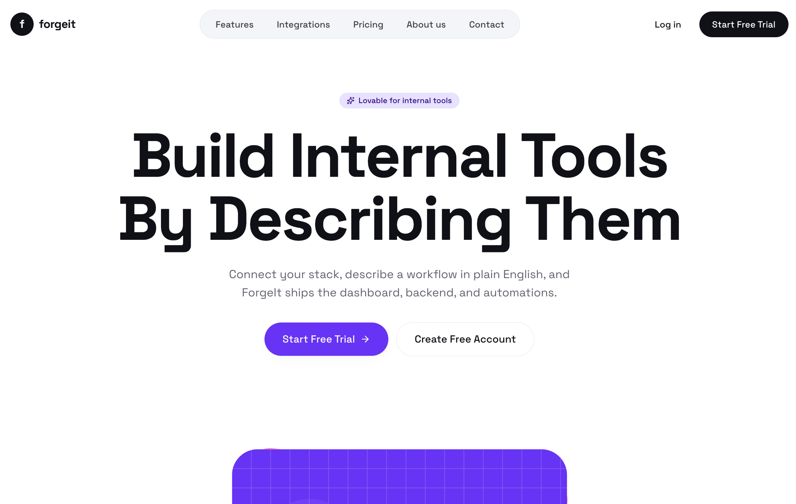
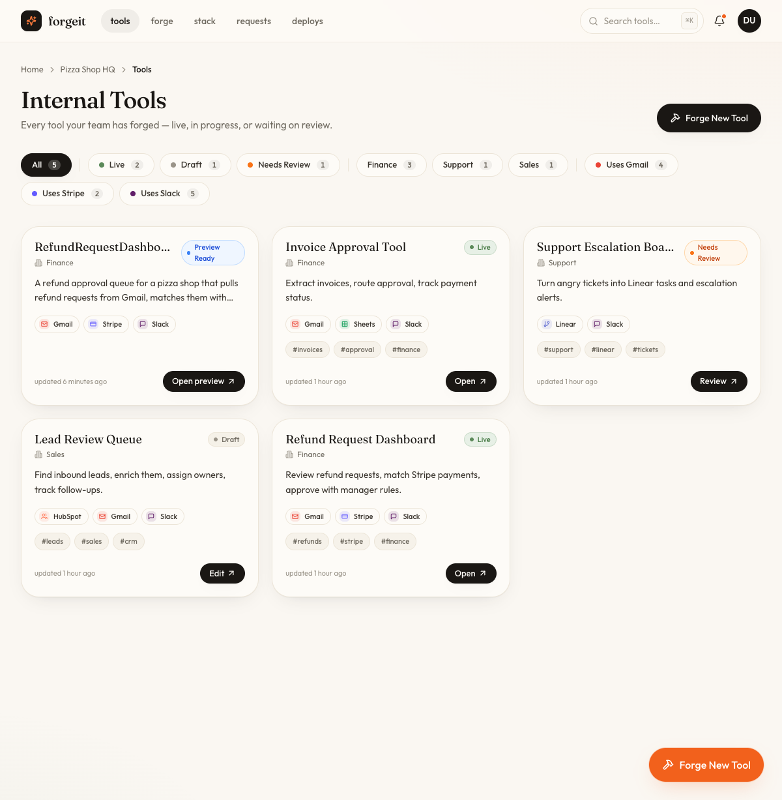
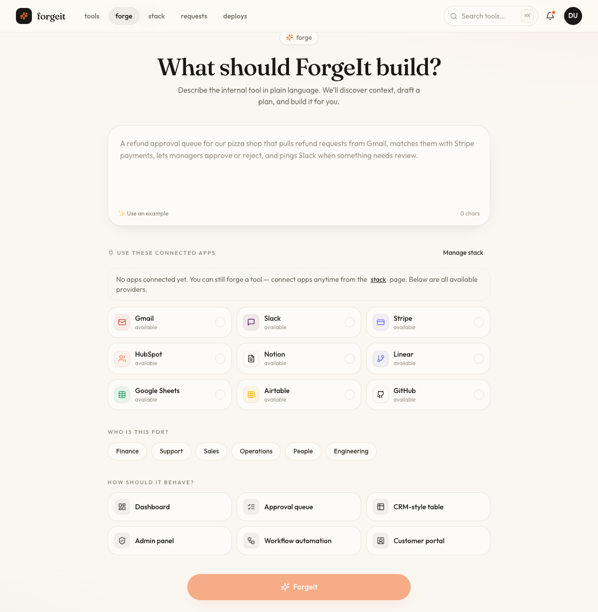

# ForgeIt

<p align="center">
  <strong>Build internal tools by describing them.</strong>
</p>

<p align="center">
  Connect your stack, describe a workflow in plain English, and ForgeIt ships the dashboard, backend, automations, preview, and deployment flow.
</p>

<p align="center">
  
</p>

<p align="center">
  
  
  
  
  
</p>

ForgeIt is a hackathon-built platform for generating real internal tools from a business prompt. The control plane turns a request into a build plan, provisions backend tables, asks OpenCode and MiniMax to generate a Vite app, serves a live preview, and can deploy the result to Railway.

## Product

<p align="center">
  
  
</p>

The first demo use case is a refund request dashboard for a pizza shop: pull refund emails from Gmail, match them to Stripe payments, let managers approve or reject requests, and notify Slack when a refund needs review.

ForgeIt supports a demo-safe mode for high-risk actions, so teams can test workflows without sending live refunds, emails, or production notifications.

## Architecture

```text
apps/web             Vite + React + Tailwind control-plane UI
apps/server          Fastify API, Prisma SQLite store, queue, SSE events
packages/shared      BuildPlan schema, enums, risk helpers, event types
packages/services    MiniMax, InsForge, Composio, and Railway clients
packages/runner      OpenCode sandbox runner, preview server, prompt builder
templates/base-app   Starter Vite app extended for generated tools
generated/.gitkeep   Runtime sandbox directory placeholder
```

Runtime flow:

```text
Prompt
  -> MiniMax build plan
  -> InsForge table provisioning
  -> OpenCode + MiniMax app generation
  -> Vite build and preview
  -> optional Railway deploy
```

## Quick Start

Requirements:

- Node.js 20+
- pnpm
- OpenCode CLI: `npm i -g opencode-ai`
- Railway CLI for real deploys: `npm i -g @railway/cli`

Install and run:

```bash
pnpm install
cp .env.example .env
pnpm --filter @forgeit/server db:generate
pnpm --filter @forgeit/server db:push
pnpm --filter @forgeit/server seed
pnpm dev
```

Open `http://localhost:5173`.

Useful scripts:

```bash
pnpm dev
pnpm --filter @forgeit/web build
pnpm --filter @forgeit/server db:generate
pnpm --filter @forgeit/server db:push
pnpm --filter @forgeit/server seed
pnpm exec tsc -b --noEmit
```

## Configuration

Copy `.env.example` to `.env` and fill only the services you want to run live.

MiniMax is required for planning and generation:

```env
MINIMAX_API_KEY=sk-cp-xxxxx
MINIMAX_BASE_URL=https://api.minimax.io/v1
MINIMAX_PLAN_MODEL=MiniMax-M2.1
MINIMAX_CODE_MODEL=MiniMax-M2.1
```

InsForge is used as the backend for generated apps:

```env
INSFORGE_API_BASE_URL=https://your-project.insforge.app
INSFORGE_API_KEY=ik_xxxxx
INSFORGE_ANON_KEY=
```

Composio is optional. Without it, connection flows and high-risk actions stay simulated:

```env
COMPOSIO_API_KEY=sk_xxxxx
COMPOSIO_AUTH_CONFIG_GMAIL=ac_xxxxx
COMPOSIO_AUTH_CONFIG_SLACK=ac_xxxxx
COMPOSIO_AUTH_CONFIG_STRIPE=ac_xxxxx
```

Railway is optional. Without a token, deploy steps fall back to demo-safe preview behavior:

```env
RAILWAY_API_TOKEN=
RAILWAY_PROJECT_ID=
```

## Demo Flow

1. Open `/tools` and choose **Forge New Tool**.
2. Enter a prompt such as: `Build a refund request dashboard for my pizza shop. Pull refund emails from Gmail, match them with Stripe payments, let managers approve refunds, and notify Slack.`
3. Review the generated plan for pages, data model, workflow, and integrations.
4. Approve the build and watch the live SSE activity log.
5. Open the generated preview iframe.
6. Deploy to Railway when live credentials are configured.

## First Customer Signal

<table>
  <tr>
    <td align="center" width="180">
      <a href="https://www.pleasurepizzasc.com/pleasure-point/menus/">
        
      </a>
    </td>
    <td>
      <strong>Pleasure Pizza</strong><br>
      Early customer validation for the first internal-tool workflow: a refund operations dashboard for a real pizza shop team.
    </td>
  </tr>
</table>

## Verification

Run these before publishing changes:

```bash
pnpm --filter @forgeit/server db:generate
pnpm --filter @forgeit/web build
pnpm exec tsc -b --noEmit
```

## Repository Notes

- Generated app sandboxes live under `generated/` at runtime and are ignored by git.
- Secrets belong in `.env`, which is ignored by git.
- `.env.example` contains placeholders only.
- This repository currently does not include an open-source license.
