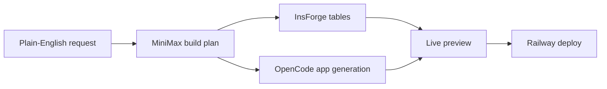
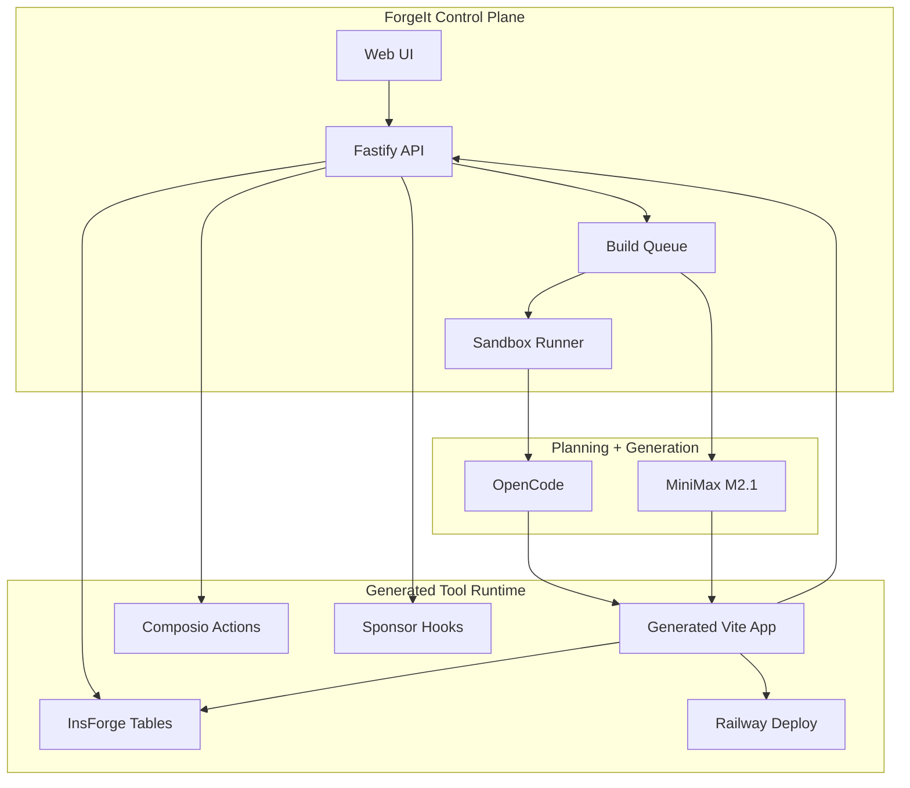

# ForgeIt

  

  <strong>Lovable for internal tools.</strong>

  ForgeIt turns a plain-English workflow into a planned, generated, previewable internal tool with real backend tables and integration-aware automations.

  
  
  
  
  

## First User

<table>
  <tr>
    <td align="center" width="100%">
      
       
      <strong>Pleasure Pizza</strong>
       
      Early customer validation for ForgeIt's first operations workflow: a refund request dashboard for a real pizza shop team.
    </td>
  </tr>
</table>

## Product

ForgeIt starts where internal-tool requests usually start: a messy business workflow. It discovers the shape of the tool, drafts the plan, generates the app, provisions the backend, streams build progress, and gives the team a preview before anything goes live.

## First Workflow

| Step | Pizza shop refund workflow | ForgeIt output |
| --- | --- | --- |
| Request | "Build a refund dashboard for my pizza shop." | Normalized app intent and selected workflow type |
| Connect | Gmail, Stripe, Slack | Integration-aware build plan |
| Model | Refund requests, customers, payments, approvals | InsForge-backed tables |
| Build | Dashboard, queue, detail view, manager actions | Generated Vite app |
| Review | High-risk refund and notification actions | Demo-safe approvals and audit trail |

## Architecture

| Layer | Stack | Role |
| --- | --- | --- |
| Control plane | Vite, React, Tailwind | Gallery, forge flow, build logs, preview, deployment review |
| API server | Fastify, Prisma, SQLite | Tool state, queues, SSE streams, action routing |
| Planning | MiniMax M2.1 | Structured build plans and change summaries |
| Generation | OpenCode, sandbox runner | Creates and builds generated internal tools |
| App backend | InsForge | Per-tool data tables for generated apps |
| Integrations | Composio | Gmail, Slack, Stripe, and other workflow actions |
| Sponsor hooks | Replicas, Devin, Memoir, Limrun | Optional backend API handoffs with simulated fallback |
| Deployment | Railway | Public deployment target for approved tools |

## What It Proves

| Product question | ForgeIt answer |
| --- | --- |
| Can a non-technical operator describe an internal tool? | Yes, the input is a workflow prompt, not a ticket spec. |
| Can the system produce a real build plan? | Yes, pages, data models, integrations, workflows, and risks are structured before generation. |
| Can generated apps use a real backend? | Yes, generated tools are backed by InsForge tables. |
| Can high-risk actions stay safe in demo mode? | Yes, refunds, emails, and notifications are routed through reviewable action flows. |
| Can sponsor APIs be claimed without blocking the demo? | Yes, sponsor hooks run live when configured and otherwise persist simulated workflow runs. |

## Sponsor API Hooks

ForgeIt exposes backend-only sponsor hooks that return stable response shapes in both live and simulated modes. Simulated mode is automatic when credentials are missing, so the demo flow still works while future real API setup stays straightforward.

| Sponsor | Route | Live env vars |
| --- | --- | --- |
| Replicas | `POST /api/tools/:id/sponsors/replicas-review` | `REPLICAS_API_KEY`, `REPLICAS_ENVIRONMENT_ID`, optional `REPLICAS_REPOSITORY`, `REPLICAS_CODING_AGENT`, `REPLICAS_MODEL`, `REPLICAS_API_BASE_URL` |
| Devin | `POST /api/tools/:id/sponsors/devin-review` | `DEVIN_API_KEY`, `DEVIN_ORG_ID`, optional `DEVIN_MODE`, `DEVIN_API_BASE_URL` |
| Memoir | `POST /api/tools/:id/sponsors/memoir-brief` | `MEMOIR_WEBHOOK_URL` |
| Limrun | `POST /api/tools/:id/sponsors/limrun-preview` | `LIM_API_KEY`, optional `LIMRUN_STREAM_BASE_URL` |

`GET /api/health` includes a `sponsors` object that shows which hooks are live versus simulated.

## Notes

This repository currently does not include an open-source license.
