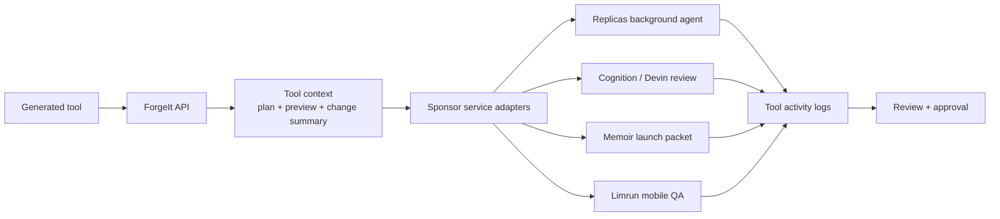

# Sponsor Integrations

ForgeIt treats sponsor services as part of the generated-tool lifecycle. The server gathers tool context, build plan, preview URL, and change summary, then routes that package through the sponsor service layer. Each sponsor run is recorded as a `WorkflowRun` so the activity log shows which review, launch, and QA steps were attached to the internal tool.

## Runtime Flow



## Integration Map

| Integration | What ForgeIt sends | What ForgeIt stores |
| --- | --- | --- |
| InsForge | Generated table definitions and app data operations | Backend table URLs, generated app data, and action records |
| Replicas | Tool name, slug, prompt, build plan summary, latest change, preview URL, production URL | Replica ID, status, URL, and raw provider response |
| Cognition / Devin | Engineering review prompt focused on safety, backend usage, demo-safe actions, and tests | Devin session ID, status, URL, and raw provider response |
| Memoir | Launch packet with product angle, proof points, suggested posts, preview URL, and production URL | Launch artifact, provider ID, status, URL, and raw provider response |
| Limrun | Mobile QA instance metadata with ForgeIt labels and preview/deploy context | Instance ID, status, stream/control URL, and raw provider response |

## Code Evidence

| Layer | Files |
| --- | --- |
| Sponsor adapters | `packages/services/src/sponsors.ts` |
| Env loading | `apps/server/src/env.ts` |
| Service construction | `apps/server/src/services.ts` |
| Health and sponsor routes | `apps/server/src/routes.ts` |
| Tool activity logs | `apps/server/prisma/schema.prisma` model `WorkflowRun` |
| Redacted checker | `scripts/check-integrations.mjs` |

## Routes

| Route | Purpose |
| --- | --- |
| `GET /api/health` | Reports platform and sponsor readiness without exposing secret values. |
| `POST /api/tools/:id/sponsors/replicas-review` | Creates a Replicas background review for a generated tool. |
| `POST /api/tools/:id/sponsors/devin-review` | Creates a Devin engineering review session. |
| `POST /api/tools/:id/sponsors/memoir-brief` | Sends the generated-tool launch packet to Memoir. |
| `POST /api/tools/:id/sponsors/limrun-preview` | Creates a Limrun mobile QA instance for review. |

Every sponsor route writes a `WorkflowRun` with `slug` set to `sponsor:<provider>`, `status` set from the provider result, and `output` containing the redacted provider artifact/status payload used by the activity log.

## Verification

Run:

```bash
pnpm check:integrations
```

The checker prints:

- integration name and purpose
- whether the code path is wired
- whether required env vars are present
- code evidence paths
- redacted env presence only, never secret values

For release checks, run:

```bash
pnpm check:integrations:strict
```

Strict mode exits non-zero until every required env var is present and every code evidence check is wired.

## Required Env Vars

| Integration | Required | Optional |
| --- | --- | --- |
| MiniMax | `MINIMAX_API_KEY` | `MINIMAX_BASE_URL`, `MINIMAX_PLAN_MODEL`, `MINIMAX_CODE_MODEL` |
| InsForge | `INSFORGE_API_BASE_URL`, `INSFORGE_API_KEY` | `INSFORGE_ANON_KEY` |
| Composio | `COMPOSIO_API_KEY` | `COMPOSIO_AUTH_CONFIG_GMAIL`, `COMPOSIO_AUTH_CONFIG_SLACK`, `COMPOSIO_AUTH_CONFIG_STRIPE` |
| Railway | `RAILWAY_API_TOKEN`, `RAILWAY_PROJECT_ID` |  |
| Replicas | `REPLICAS_API_KEY`, `REPLICAS_ENVIRONMENT_ID` | `REPLICAS_REPOSITORY`, `REPLICAS_CODING_AGENT`, `REPLICAS_MODEL`, `REPLICAS_API_BASE_URL` |
| Cognition / Devin | `DEVIN_API_KEY`, `DEVIN_ORG_ID` | `DEVIN_MODE`, `DEVIN_API_BASE_URL` |
| Memoir | `MEMOIR_WEBHOOK_URL` |  |
| Limrun | `LIM_API_KEY` | `LIMRUN_BASE_URL`, `LIMRUN_PLATFORM`, `LIMRUN_STREAM_BASE_URL` |
| Vercel | `VERCEL_PROJECT_ID` | `VERCEL_PROJECT_PRODUCTION_URL`, `VERCEL` |

## Real Key Setup

Place real values in local `.env` for local testing and in the deploy provider's environment settings for production. Do not commit `.env`; it is already ignored by git.

Minimum sponsor setup:

- Replicas: `REPLICAS_API_KEY`, `REPLICAS_ENVIRONMENT_ID`
- Cognition / Devin: `DEVIN_API_KEY`, `DEVIN_ORG_ID`
- Memoir: `MEMOIR_WEBHOOK_URL`
- Limrun: `LIM_API_KEY`
- InsForge: `INSFORGE_API_BASE_URL`, `INSFORGE_API_KEY`

Recommended platform setup:

- MiniMax: `MINIMAX_API_KEY`
- Composio: `COMPOSIO_API_KEY` plus any provider auth config IDs used in the demo
- Railway: `RAILWAY_API_TOKEN`, `RAILWAY_PROJECT_ID`
- Vercel: `VERCEL_PROJECT_ID`, `VERCEL_PROJECT_PRODUCTION_URL`

## External References

- Replicas exposes `create_replica` and related background-agent operations in its public docs: https://docs.replicas.dev/features/mcp
- Devin's v3 common flow uses `DEVIN_API_KEY`, `DEVIN_ORG_ID`, and session creation under `/organizations/{org_id}/sessions`: https://docs.devin.ai/ja/api-reference/common-flows
- Limrun documents cloud iOS/Android instances and SDK-driven control plane flows: https://docs.limrun.com/docs
- Limrun's Python SDK documents `LIM_API_KEY` and Android instance creation: https://pypi.org/project/limrun-api/
